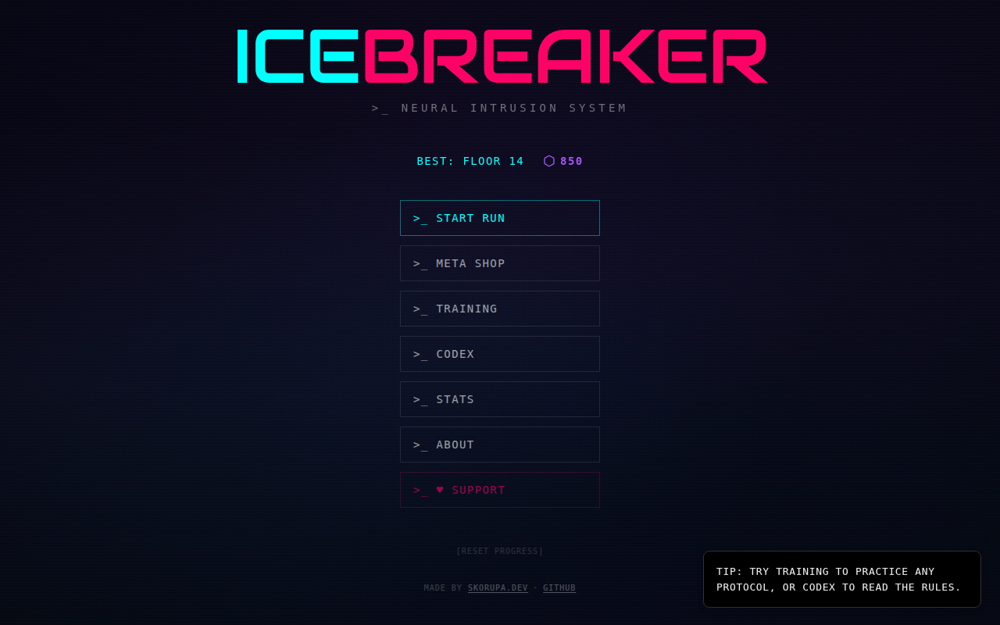
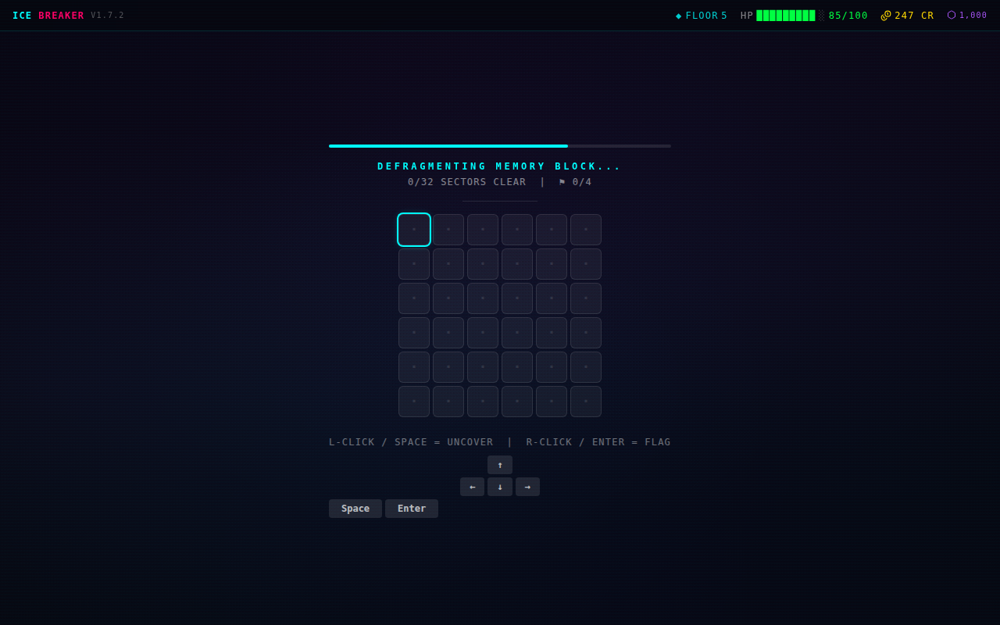
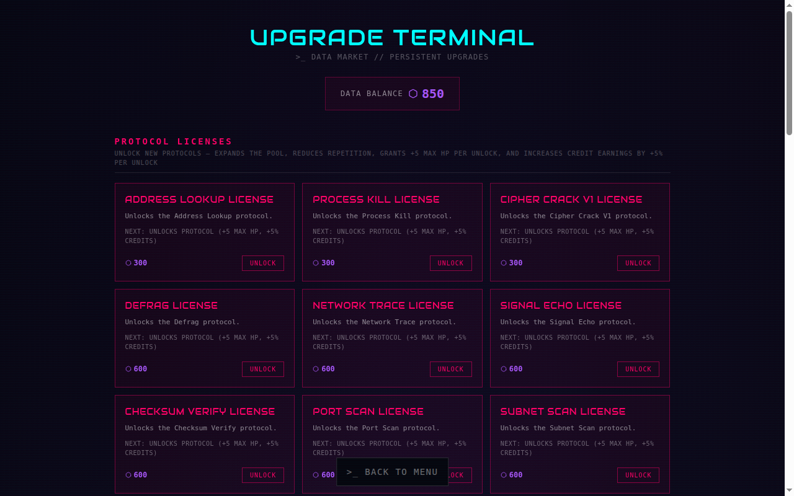
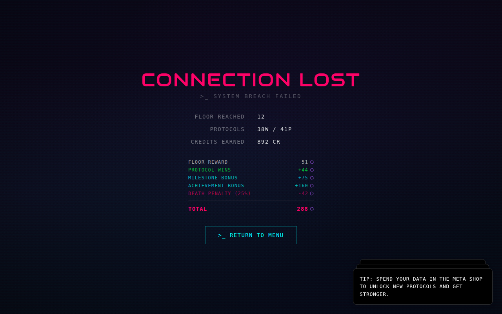

# ICEBREAKER — Neural Intrusion System

[](https://icebreaker.skorupa.dev)
[](LICENSE)

A cyberpunk roguelike browser minigame collection. Each run sends you through a gauntlet of hacking-themed reaction challenges, growing harder with every floor. Survive long enough to spend your DATA in the meta shop and unlock new intrusion modules for future runs.

Inspired by the hacking minigames from [Bitburner](https://store.steampowered.com/app/1812820/Bitburner/).

> Built with heavy AI assistance — the most important skill was knowing when to delete what the AI wrote.

## Gameplay

| | |
|---|---|
|  |  |
| Main menu — hub for runs, meta progression, training | Defrag minigame — uncover safe cells, avoid mines |
|  |  |
| Meta shop — spend DATA on permanent upgrades and new protocols | Death screen — full data breakdown for each run |

---

## Features

- **15 minigames** — 5 available from the start, 10 more unlockable through meta progression
  - Slash Timing, Code Inject, Decrypt Signal, Packet Route, Memory Scan
  - Address Lookup, Process Kill, Cipher Crack V1 & V2, Defrag, Network Trace
  - Signal Echo, Checksum Verify, Port Scan, Subnet Scan
- **70 achievements** across 7 categories — progression, skill, speed, economy, survival, playstyle, and cumulative milestones
- **Meta progression** — earn DATA across runs; spend it in the Meta Shop to unlock minigames, buy permanent upgrades, and expand your power-up pool
- **Run shop** — pick power-ups between floors to modify timing windows, shield against damage, skip dangerous challenges, and more
- **Training mode** — practice individual minigames outside of a run
- **Codex** — in-game reference for all minigame rules
- **Stats** — lifetime statistics, per-minigame breakdowns, and achievement gallery
- **Mobile-ready** — touch controls supported across all minigames
- **Cyberpunk aesthetic** — glitch effects, cyan/magenta palette, Audiowide heading font, terminal-style UI

---

## Live Stats

Public analytics via Umami — pageviews, sessions, and custom game events (runs completed, minigame popularity, achievement unlock rate, deepest floor reached).

**▶ [View live dashboard](https://cloud.umami.is/share/qOtEaYQgY8lrxAmA)**

No cookies, no personal data, no tracking pixels — just aggregate game metrics to see which protocols are most-played and how deep players go.

---

## Tech Stack

| Layer | Technology |
|---|---|
| Framework | React 19 |
| Language | TypeScript 6 |
| Build tool | Vite 8 |
| Styling | Tailwind CSS 4 |
| State management | Zustand 5 |
| Animations | Motion (Framer Motion) 12 |
| UI primitives | Radix UI, shadcn/ui |
| Notifications | Sonner |
| Icons | Lucide React |
| Deployment | Fly.io (nginx, Docker) |

---

## Getting Started

### Prerequisites

- Node.js 22+
- npm

### Install

```bash
npm install
```

### Dev server

```bash
npm run dev
```

Starts Vite dev server at `http://localhost:5173`.

### Build

```bash
npm run build
```

Compiles TypeScript and bundles into `dist/`. Preview the production build with:

```bash
npm run preview
```

---

## Deployment

The app is deployed on [Fly.io](https://fly.io) as a static site served by nginx.

**App:** `icebreaker-skorupa` — primary region: Amsterdam (`ams`)

The Docker build uses a two-stage pipeline:

1. **Build stage** — Node 22, runs `npm ci` + `npm run build`
2. **Serve stage** — nginx serves the compiled `dist/` as static files over port 80

HTTPS is enforced by Fly.io's TLS termination (`force_https = true`). Machines auto-stop when idle and spin up on demand.

To deploy manually:

```bash
fly deploy
```

---

## Project Structure

```
icebreaker/
├── src/
│   ├── components/
│   │   ├── minigames/     # One component per minigame (15 total)
│   │   ├── screens/       # Full-screen views (MainMenu, MetaShop, Codex, Stats…)
│   │   ├── layout/        # MinigameShell, HUD, TimerBar, TouchControls…
│   │   └── ui/            # CyberButton, ScreenHeader, ResultFlash…
│   ├── data/              # Static game data, balancing formulas, minigame configs
│   ├── hooks/             # Custom React hooks
│   ├── lib/               # Shared utilities, achievement checker
│   ├── store/             # Zustand store (run-slice, meta-slice, shop-slice)
│   ├── types/             # TypeScript types (game.ts, minigame.ts, shop.ts)
│   ├── __tests__/         # Unit tests (Vitest)
│   └── App.tsx            # Root component / screen router
├── e2e/                   # E2E tests (Playwright)
├── docs/                  # Architecture, economy, minigame docs
├── public/                # Static assets (fonts, images, OG image)
├── Dockerfile
├── fly.toml
├── nginx.conf
└── vite.config.ts
```

---

## License

MIT License — see [LICENSE](LICENSE) for details.

---

## Credits

- **Martin Skorupa** — [skorupa.dev](https://skorupa.dev) · [LinkedIn](https://linkedin.com/in/martin-skorupa) · [Ko-fi](https://ko-fi.com/stratorheus)
- Inspired by the hacking minigames in **Bitburner** by danielyxie
- [Audiowide](https://fonts.google.com/specimen/Audiowide) font by Astigmatic — licensed under SIL Open Font License 1.1
